### Hi there 👋 Welcome to my page!

## About Me

A self-taught web developer from with a passion for creating responsive, mobile-first web apps.

## Programming Languages

  
  
  
  
  <!--  -->
  
  

## Frameworks and Libraries

  
  <!--  -->
  
  
  
  
  
  
  
  
  <!--  -->

## Tools

  
  
  
  
  
  
  
  
  
  

## My Projects

    
    

      
    
<!--      -->

<!-- ## Contact Me

 -->
